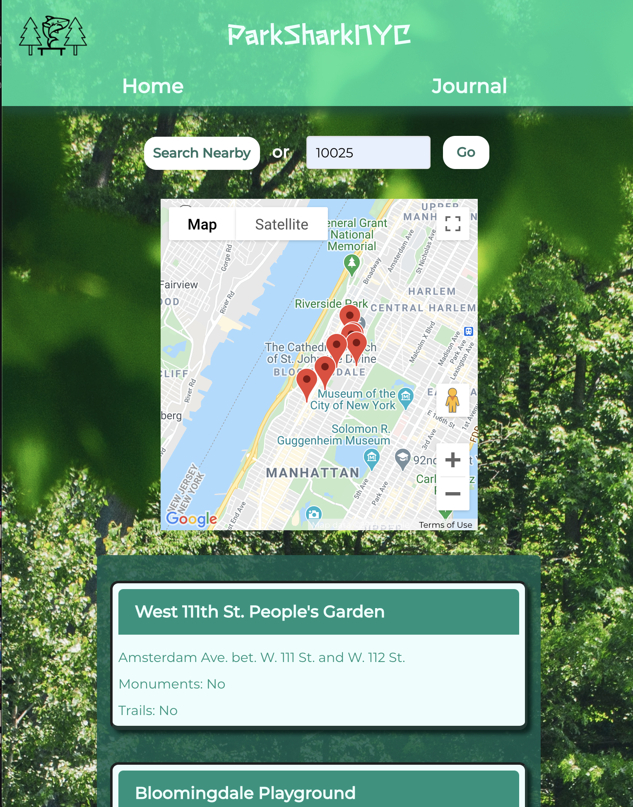
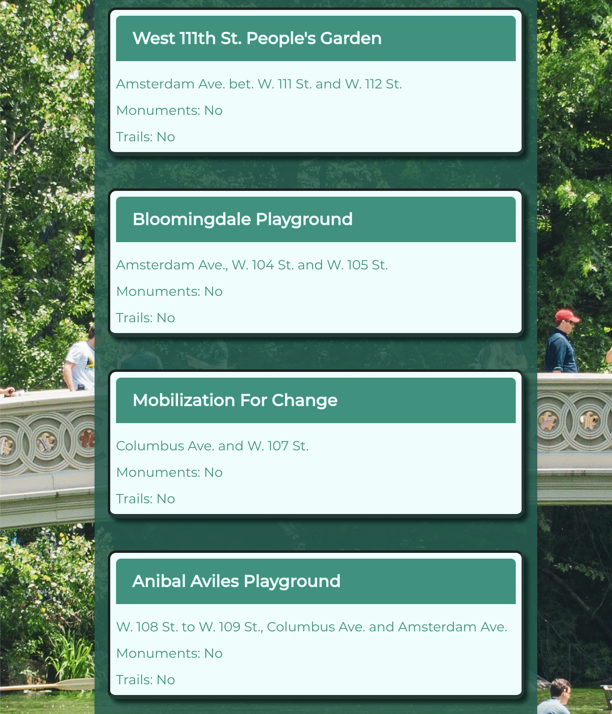

# ParkSharkNYC

Go to the deployed application here: 
https://ladystephani.github.io/ParkSharkNYC/

- [Team Members](#team-members)
- [Description ](#description)
- [Technical Notes](#technical-notes)
- [Installation and Usage](#installation-and-use)
- [License](#license)

## Application Appearance

## Team Members

Zhe Qi (Jessie) Li,
Samy Ozuna,
Sean Weber,
Tomek Regulski

## Description

ParkSharkNYC is an app designed for users who enjoy visiting New York City Parks, exploring their features, and documenting their visits.

The app lands on the homepage to search for park destinations, presenting the user with the option to either press a button that submits their coordinates, or search by zip code. In either case, a function will search through an array of NYC park properties and select all that are within a mile radius of the search coordinates.

Once the results are retrieved, they are plotted onto a map, as well as rendered as a list of search results. The user is then able to see the park name, its address, and whether or not it features historical monuments or official trails. From here, the user can plan their next park adventure!

Another page, titled 'Journal', allows the user to log the park experience as a simple journal entry, which gets stored in localStorage. They are able to view all past entries by pressing the "Memories" link, which then renders a table that can be sorted either by date or park name.

## Technical Notes

This app makes use of HTML, CSS, JavaScript, Bulma, Google Fonts, Leaflet.js API, and NYC Open Data APIs. The particular NYC Open Data APIs used are Park Properties, Trails, and Monuments.

When the app first loads, a function is triggered to make a request to the Park Properties API, collect the names, addresses and coordinates of the parks, and store them in the local array 'parksArray'.

Once this process has completed, requests are made to the Trails and Monuments APIs to retrieve the names of parks that contain either of these features, and those results are integrated with parksArray. This new local array of parknames and features is then run through a function that compares their coordinates with those of the user's search. The parks that fall within a mile of the search coordinates are pushed to a new array "parkResults", which is used to create markers on the map and to render the search result cards.

The Leaflet.js API is used to display an area centered on the search coordinates, and to show markers for each park that was returned in the search results.

## Installation and Use

Clone the repo to a local directory and open it in the code editor of your choice.

Then simply run index.html in the browser of your choice, and plan your next park adventure!

# License

MIT License

Copyright (c) [2021] [Zhe Qi (Jessie) Li, Samy Ozuna, Sean Weber, Tomek Regulski]

Permission is hereby granted, free of charge, to any person obtaining a copy
of this software and associated documentation files (the "Software"), to deal
in the Software without restriction, including without limitation the rights
to use, copy, modify, merge, publish, distribute, sublicense, and/or sell
copies of the Software, and to permit persons to whom the Software is
furnished to do so, subject to the following conditions:

The above copyright notice and this permission notice shall be included in all
copies or substantial portions of the Software.

THE SOFTWARE IS PROVIDED "AS IS", WITHOUT WARRANTY OF ANY KIND, EXPRESS OR
IMPLIED, INCLUDING BUT NOT LIMITED TO THE WARRANTIES OF MERCHANTABILITY,
FITNESS FOR A PARTICULAR PURPOSE AND NONINFRINGEMENT. IN NO EVENT SHALL THE
AUTHORS OR COPYRIGHT HOLDERS BE LIABLE FOR ANY CLAIM, DAMAGES OR OTHER
LIABILITY, WHETHER IN AN ACTION OF CONTRACT, TORT OR OTHERWISE, ARISING FROM,
OUT OF OR IN CONNECTION WITH THE SOFTWARE OR THE USE OR OTHER DEALINGS IN THE
SOFTWARE.
